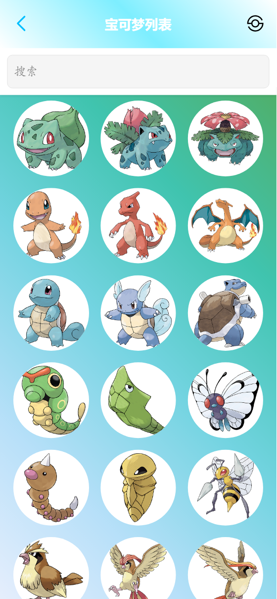
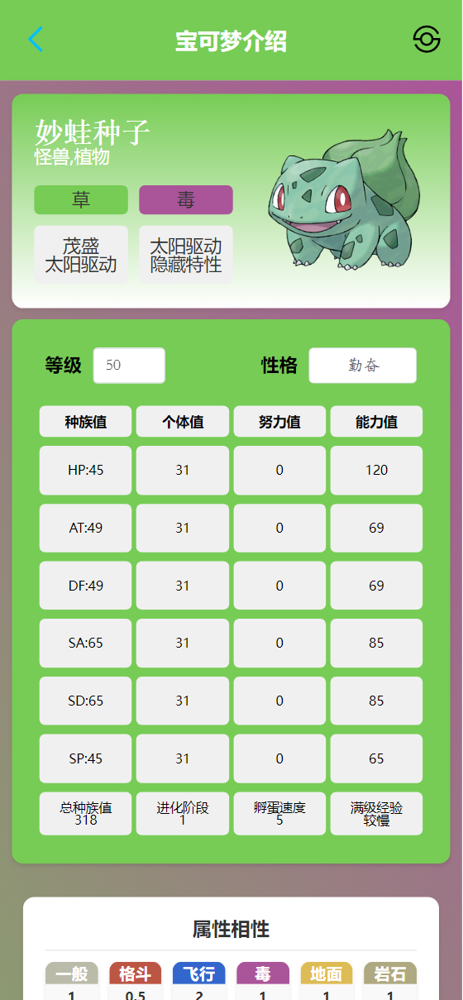
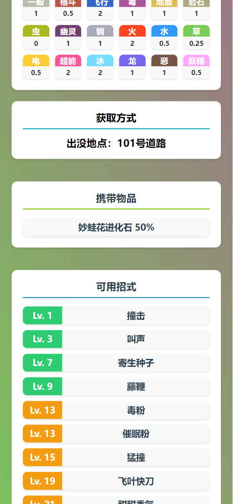
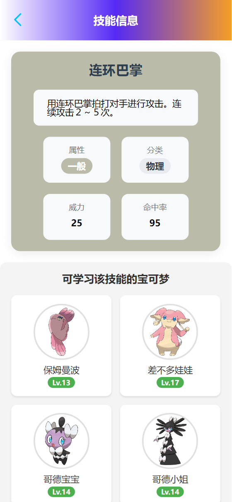

# 宝可梦图鉴 App - 手机版

[](https://gitee.com/forgotten-seventeen)
[](https://blog.csdn.net/iku_n?spm=1000.2115.3001.5343)

## 项目简介

这是一个专为宝可梦粉丝打造的手机版宝可梦图鉴应用，旨在为用户提供一个便捷、功能丰富的宝可梦查询工具。你可以浏览所有宝可梦的详细信息，收藏喜欢的宝可梦，并随时随地查看它们的属性和技能。

## 开源社区
- **CSDN**: [沙琪马 CSDN](https://blog.csdn.net/iku_n?type=blog)
- **Gitee**: [沙琪马 Gitee](https://gitee.com/forgotten-seventeen)


## 功能特点

- **全面图鉴**：收录所有代的宝可梦，支持查看详细信息。
- **高质量图片**：提供高清宝可梦立图和各个角度的模型展示。
- **搜索功能**：支持通过名称、属性、技能等关键词搜索宝可梦。
- **离线访问**：部分功能支持离线使用，方便网络不佳时查阅。

## 技术栈

- **前端框架**：Vue 3
- **状态管理**：Pinia
- **类型系统**：TypeScript
- **包管理工具**：npm
- **本地存储**：localStorage
- **PWA 支持**：通过 service worker 实现离线功能

## 安装与使用

### 环境要求

- Node.js 16+
- npm 或 yarn
- Android Studio 或 Xcode（可选）

### 获取代码

```bash
git clone https://gitee.com/forgotten-seventeen/speaker-cricket-hero-guide.git
cd pokemon
```
### 安装依赖
```
npm install
```
### 运行项目
```
npm run dev
```
## 展示效果








